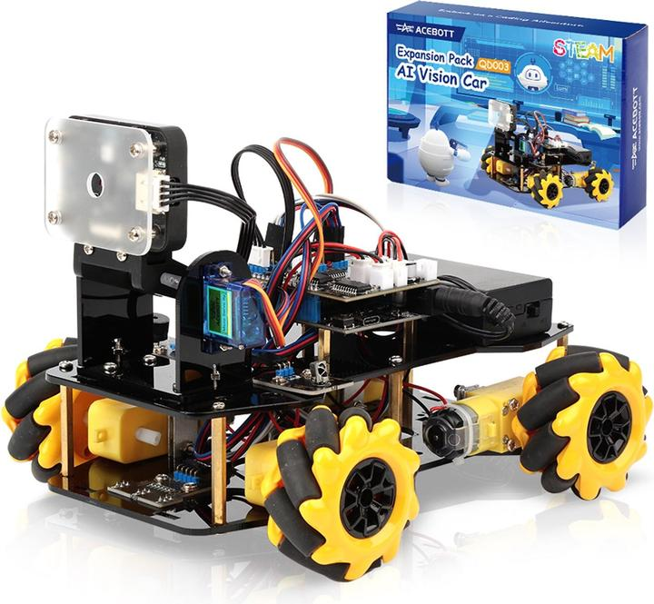

# ACEBOTT QD001 Pro / QD003 AI Vision Car — Python Interface



A complete Python interface, GUI controller, and autonomous navigation toolkit for the **ACEBOTT QD001 Pro** and **QD003 AI Vision Car** — mecanum-wheel smart cars based on the ESP32 microcontroller.

---

## Table of Contents

- [Hardware Overview](#hardware-overview)
- [Firmware Variants](#firmware-variants)
  - [QD001 Pro — Standard Firmware](#qd001-pro--standard-firmware)
  - [QD003 — AI Vision Firmware](#qd003--ai-vision-firmware)
- [Repository Structure](#repository-structure)
- [Requirements](#requirements)
- [Quick Start](#quick-start)
- [Python Modules](#python-modules)
  - [acebott_car.py — QD001 Pro](#acebott_carp--qd001-pro)
  - [acebott_cv_car.py — QD003](#acebott_cv_carp--qd003)
- [GUI Controllers](#gui-controllers)
  - [car_gui.py — QD001 Pro Controller](#car_guipy--qd001-pro-controller)
  - [cv_car_gui.py — QD003 CV Controller](#cv_car_guipy--qd003-cv-controller)
- [Traffic Sign Navigator](#traffic-sign-navigator)
- [Communication Protocol](#communication-protocol)
- [Known Hardware Quirks](#known-hardware-quirks)
- [Running the Tests](#running-the-tests)

---

## Hardware Overview

The ACEBOTT smart car is a 4-wheel mecanum-drive robot built around the **ESP32** microcontroller. Mecanum wheels allow omnidirectional movement: forward, backward, strafe left/right, diagonal, and spin in place.

**Common hardware (both variants):**
- ESP32 development board
- 4× DC motors with mecanum wheels
- 3× IR line-tracking sensors (left, center, right)
- 1× Pan servo (Y-axis, pin 25) — tilts the camera/sensor
- Buzzer (pin 33)
- Built-in WiFi — runs as a **TCP server** on port 100

**QD001 Pro additions:**
- HC-SR04 ultrasonic distance sensor (trig: 13, echo: 14)
- Shoot solenoid (pin 32, 150 ms pulse)
- 2× LED modules (pins 2, 12)
- Tilt servo (T-axis, pin 26) — *firmware bug: never attached*

**QD003 additions:**
- **ACB_CanMV** AI camera coprocessor (connected via UART over I²C pins SDA/SCL)
- RGB LED on the camera module
- Camera has its own LCD screen — it does **not** stream video over WiFi

---

## Firmware Variants

### QD001 Pro — Standard Firmware

**File:** `car_firmware/car_firmware.ino`  
**WiFi SSID:** `ESP32-CAR` | **Password:** `12345678`

The base firmware. Provides manual motor control and four autonomous modes driven by onboard sensors.

| Mode | Command | Description |
|---|---|---|
| Manual control | `CMD_RUN` | Full motor/servo/LED/buzzer/shooter control |
| Standby | `CMD_STANDBY` | Stop everything, centre servo |
| Line Follow 1 | `CMD_TRACK_1` | 2-sensor IR line following (left + right) |
| Line Follow 2 | `CMD_TRACK_2` | 3-sensor IR line following (left + center + right) |
| Obstacle Avoidance | `CMD_AVOID` | Ultrasonic scan → choose clearest path |
| Follow Mode | `CMD_FOLLOW` | Maintain 15–50 cm distance to object ahead |

**`parseData()` layout:** Single switch on `buffer[9]` (action). CV modes do not exist.

---

### QD003 — AI Vision Firmware

**File:** `car_firmware_cv/car_firmware_cv.ino`  
**WiFi SSID:** `ESP32_QD003` | **Password:** `12345678`

Extends the base firmware with a **ACB_CanMV AI camera coprocessor**. The camera runs inference locally and sends recognition results as text strings to the ESP32 over UART, which are forwarded to the connected TCP client.

| Mode | Command | Description |
|---|---|---|
| Manual control | `CMD_RUN` | Motor/servo/buzzer control (no LED, no shooter) |
| Standby | `CMD_STANDBY` | Stop everything, centre servo |
| Line Follow 1 | `CMD_TRACK_1` | IR 2-sensor line following |
| Line Follow 2 | `CMD_TRACK_2` | IR 3-sensor line following |
| QR Code | `DEV_QR_CODE` (30) | Recognise QR codes, stream content as tag |
| Barcode | `DEV_BARCODE` (31) | Recognise barcodes |
| Digit Recognition | `DEV_DIGITAL_RECOG` (32) | Recognise digits 0–9 |
| Colour Recognition | `DEV_COLOR_RECOG` (33) | Identify dominant colour in frame |
| Image Recognition | `DEV_IMAGE_RECOG` (34) | Generic image classifier |
| **Colour Tracking** | `DEV_COLOR_TRACK` (35) | Car physically chases a target colour |
| **Visual Patrol** | `DEV_VISUAL_PATROL` (36) | Camera-based line following (servo tilts to 35°) |
| **Traffic Signs** | `DEV_TRAFFIC` (37) | Read traffic signs and drive accordingly |
| Machine Learning | `DEV_ML` (38) | Custom ML inference |
| Face Recognition | `DEV_FACE_RECOG` (39) | Detect faces |
| RGB LED | `DEV_RGB_*` (41/42/43) | Control RGB LED on camera module |
| Stop CV | `DEV_TAKE_STOP` (50) | Return camera to menu screen |

**Traffic signs supported:** `Go_Straight`, `Turn_Right`, `Turn_Left`, `Turn_Around`, `Throughout`

**Key difference from QD001:** `parseData()` runs **two separate switch statements** — one on `buffer[9]` (action) and one on `buffer[10]` (device). CV modes are activated by the device field regardless of the action field. Also, `parseData()` always calls `Acebott.Move(Stop, 0)` before processing — every received packet resets motion first.

> **Note:** The ACB_CanMV camera has its own LCD screen and communicates with the ESP32 over UART. It does **not** serve a video stream over WiFi. Recognition results arrive as newline-terminated text strings over TCP.

---

## Repository Structure

```
acebott-qd001-pro/
│
├── car_firmware/
│   └── car_firmware.ino        # QD001 Pro firmware (Arduino)
│
├── car_firmware_cv/
│   └── car_firmware_cv.ino     # QD003 AI Vision firmware (Arduino)
│
├── acebott_car.py              # QD001 Pro Python module  ← import this
├── acebott_cv_car.py           # QD003 Python module      ← import this
│
├── car_client.py               # QD001 Pro quick demo script
├── car_gui.py                  # QD001 Pro GUI controller
├── cv_car_gui.py               # QD003 GUI controller
├── traffic_navigator.py        # Autonomous traffic sign navigator
│
└── test/
    ├── run_all.py              # Run all test suites
    ├── test_connection.py      # Connection tests (no movement)
    ├── test_movement.py        # Motor direction tests
    ├── test_peripherals.py     # LED, buzzer, speed, shooter tests
    └── test_modes.py           # Autonomous mode tests
```

---

## Requirements

- Python 3.10+
- No external packages required for the core modules or GUIs (Tkinter is built in)

Connect to the car's WiFi before running any script:

| Firmware | SSID | Password |
|---|---|---|
| QD001 Pro | `ESP32-CAR` | `12345678` |
| QD003 | `ESP32_QD003` | `12345678` |

The car's IP address is always `192.168.4.1` (ESP32 AP default).

---

## Quick Start

**QD001 Pro:**
```python
from acebott_car import AcebottCar
import time

with AcebottCar() as car:
    car.forward(speed=200)
    time.sleep(1)
    car.stop()
```

**QD003:**
```python
from acebott_cv_car import AcebottCVCar

def on_tag(tag):
    print("Detected:", tag)

with AcebottCVCar() as car:
    car.set_tag_callback(on_tag)
    car.mode_traffic_identification()
    time.sleep(30)
```

---

## Python Modules

### `acebott_car.py` — QD001 Pro

Import this in any application. Never run it directly.

```python
from acebott_car import AcebottCar, MIN_EFFECTIVE_SPEED

car = AcebottCar(ip="192.168.4.1", port=100)
car.connect()
```

**Movement methods:**

| Method | Description |
|---|---|
| `forward(speed)` | Move forward |
| `backward(speed)` | Move backward |
| `strafe_left(speed)` | Translate left |
| `strafe_right(speed)` | Translate right |
| `turn_left(speed)` | Spin counter-clockwise |
| `turn_right(speed)` | Spin clockwise |
| `diagonal(direction, speed)` | Diagonal move — use `DIR_TOP_LEFT` etc. |
| `stop()` | Stop all motors immediately |
| `move(direction, speed)` | Low-level — pass any `DIR_*` constant |

**Peripheral methods:**

| Method | Description |
|---|---|
| `set_speed(speed)` | Set global motor speed (0–255) |
| `set_servo(angle)` | Tilt servo angle (0–180°) |
| `set_leds(on)` | LED modules on/off |
| `shoot()` | Trigger shooter (150 ms pulse) |
| `play_tune(1–4)` | Play built-in tune |

**Autonomous mode methods:**

| Method | Description |
|---|---|
| `standby()` | Cancel mode, stop motors |
| `mode_line_follow_1()` | IR 2-sensor line follow |
| `mode_line_follow_2()` | IR 3-sensor line follow |
| `mode_obstacle_avoid()` | Ultrasonic obstacle avoidance |
| `mode_follow()` | Ultrasonic follow (15–50 cm) |

**Constants:**
```python
MIN_EFFECTIVE_SPEED = 150   # motors stall below this on hard floor
DIR_FORWARD, DIR_BACKWARD, DIR_STRAFE_LEFT, DIR_STRAFE_RIGHT
DIR_TOP_LEFT, DIR_TOP_RIGHT, DIR_BOTTOM_LEFT, DIR_BOTTOM_RIGHT
DIR_SPIN_CCW, DIR_SPIN_CW
```

---

### `acebott_cv_car.py` — QD003

```python
from acebott_cv_car import AcebottCVCar, COLOR_RED

car = AcebottCVCar(ip="192.168.4.1", port=100)
car.connect()
```

Inherits all movement, speed, servo, and buzzer methods from the QD001 interface. Adds:

**CV mode methods:**

| Method | Description |
|---|---|
| `mode_qr_code()` | QR code recognition |
| `mode_barcode()` | Barcode recognition |
| `mode_digital_recognition()` | Digit recognition |
| `mode_color_recognition()` | Colour identification |
| `mode_image_recognition()` | Image classification |
| `mode_color_tracking(color_id)` | Chase a colour — pass `COLOR_RED` etc. |
| `mode_visual_patrol()` | Camera-based line following |
| `mode_traffic_identification()` | Traffic sign autonomous driving |
| `mode_machine_learning()` | Custom ML inference |
| `mode_face_recognition()` | Face detection |
| `stop_cv()` | Stop CV, return camera to menu |

**RGB LED:**
```python
car.set_rgb(r=255, g=0, b=0)     # set all channels at once
car.set_rgb_red(128)              # set individual channel
```

**Receiving recognition tags:**
```python
# Option 1 — callback (runs on receive thread)
car.set_tag_callback(lambda tag: print(tag))

# Option 2 — polling (safe for GUI main loops)
tag = car.get_tag()   # returns str or None
```

**Colour constants:** `COLOR_RED=1`, `COLOR_GREEN=2`, `COLOR_BLUE=3`, `COLOR_YELLOW=4`

---

## GUI Controllers

### `car_gui.py` — QD001 Pro Controller

```
python car_gui.py
```

- **D-pad** with diagonal buttons — click and hold to move, release to stop
- **Spin left / right** buttons  
- **Speed slider** (150–255)
- Keyboard shortcuts: `W/S` = Fwd/Bwd · `A/D` = Strafe · `Q/E` = Spin · `Space` = Stop
- Connect / Disconnect button with background thread (UI stays responsive)

---

### `cv_car_gui.py` — QD003 CV Controller

```
python cv_car_gui.py
```

- All movement controls from the QD001 GUI
- **CV Modes panel** — 12 mode buttons, sunken highlight shows active mode
- **Colour selector** radio buttons for colour tracking target
- **RGB LED sliders** for the camera module LED (R/G/B, 0–255 each)
- **Live Recognition panel** — large text shows latest tag, mode badge, timestamped log

---

## Traffic Sign Navigator

```
python traffic_navigator.py
```

A standalone autonomous navigation monitor. Connect to the QD003, place ACEBOTT traffic sign cards along a course, and start a mission.

**Features:**
- **Live route map** — 512×512 canvas draws the car's path and marks each sign with its icon and colour as the car reads them. A compass arrow shows current heading.
- **Four mission types:**
  - *Manual* — log and map only, never auto-stop
  - *Stop after N signs* — halts the car after N total signs
  - *Stop on specific sign* — e.g. stop when `Throughout` is seen
  - *Stop on sequence* — e.g. stop when `Go_Straight,Turn_Right,Throughout` is matched in order
- **Sign log** — timestamped coloured log of every detected sign
- **Raw data feed** — shows all raw strings received from the car (diagnostic)
- **Export JSON** — saves full route coordinates, sign positions, and log

**Traffic signs and their effects:**

| Sign | Car action | Map icon |
|---|---|---|
| `Go_Straight` | Forward 500 ms | ↑ (blue) |
| `Turn_Right` | Clockwise 500 ms | → (green) |
| `Turn_Left` | Counter-clockwise 500 ms | ← (green) |
| `Turn_Around` | Forward → spin 180° → forward | ↩ (yellow) |
| `Throughout` | Stop (no entry) | ✕ (red) |

> **Important:** Signs must be the official ACEBOTT printed cards. The ACB_CanMV model is trained on specific images and will not recognise arbitrary traffic sign printouts. Ensure adequate lighting and hold the sign 20–40 cm from the camera.

---

## Communication Protocol

Both firmwares use the same binary TCP protocol. All packets are 13 bytes:

```
Byte  0:   0xFF          frame header byte 1
Byte  1:   0x55          frame header byte 2
Byte  2:   0x0A          length = 10 (bytes 3–12)
Bytes 3–8: 0x00 × 6      unused
Byte  9:   [action]      command ID  (CMD_RUN=1, CMD_STANDBY=3, etc.)
Byte 10:   [device]      device/mode ID
Byte 11:   0x00          unused
Byte 12:   [val]         value (direction / angle / speed / colour)
```

The firmware parser looks for `prevc == 0xFF` then `c == 0x55` to detect the start of a packet, then reads `buffer[2]` as the remaining byte count.

**Keep-alive:** The firmware disconnects the client if no data is received for 3 seconds and the idle flag `st` is set. The Python modules send a `0x00` byte every 2 seconds — harmless to the parser but resets the idle timer and does not interfere with autonomous modes.

---

## Known Hardware Quirks

These are firmware/hardware behaviours discovered during testing:

| Issue | Cause | Fix applied in Python |
|---|---|---|
| Spin left/right doesn't work without a prior move | `ACB_SmartCar_V2` library requires motors to be energised in reverse before `Contrarotate`/`Clockwise` engages | 150 ms backward pre-pulse before spin commands |
| Bottom diagonals don't work without a prior move | Same library quirk — backward-direction moves need pre-energising | 150 ms backward pre-pulse before `Bottom_Left`/`Bottom_Right` |
| Intermittent strafe right failure | Two back-to-back packets (DEV_SPEED + DEV_MOTOR) — race condition | Speed is cached; DEV_SPEED packet only sent when speed changes |
| `set_servo()` on QD001 Pro does nothing | `Tservo.attach()` never called in firmware `setup()` | N/A — firmware bug |
| CV modes cancelled every 2 s | Old heartbeat sent `CMD_STANDBY` packet | Heartbeat now sends `0x00` (ignored by parser) |
| Speed below ~150 produces no movement | Motor PWM threshold — static friction on hard floor | `MIN_EFFECTIVE_SPEED = 150` constant |

---

## Running the Tests

Tests cover the QD001 Pro. Connect to `ESP32-CAR` WiFi first.

```bash
# Individual suites
python test/test_connection.py    # automated, no movement
python test/test_peripherals.py   # LEDs, buzzer, speed (bench-safe)
python test/test_movement.py      # all 11 directions (car moves)
python test/test_modes.py         # autonomous modes (needs environment)

# Run all
python test/run_all.py
```

Movement and mode tests are interactive — you confirm whether the car behaved correctly with `[y/n]` prompts.
